# GPIO

GPIO : General Purpose Input Output. On STM32F401, GPIO peripherals are connected to the AHB1 bus.

Each GPIO port has its own register block. For example:


Each port is separated by `0x400` bytes.
## GPIO Registers

Each GPIO port has the same register layout. Only the base address changes.

| Register | Offset | Function |
| -------- | ------ | -------- |
| [`MODER`](#moder) | `0x00` | Selects pin mode: input, output, alternate function, or analog |
| [`OTYPER`](#otyper) | `0x04` | Selects output type: push-pull or open-drain |
| [`OSPEEDR`](#ospeedr) | `0x08` | Selects output speed |
| [`PUPDR`](#pupdr) | `0x0C` | Enables/disables pull-up or pull-down resistors |
| [`IDR`](#idr) | `0x10` | Reads input pin state |
| [`ODR`](#odr) | `0x14` | Reads/writes output pin state |
| [`BSRR`](#bsrr) | `0x18` | Atomically sets or resets output pins |
| [`LCKR`](#lckr) | `0x1C` | Locks GPIO configuration |
| [`AFRL`](#afrl) | `0x20` | Alternate function selection for pins 0 to 7 |
| [`AFRH`](#afrh) | `0x24` | Alternate function selection for pins 8 to 15 |
### MODER

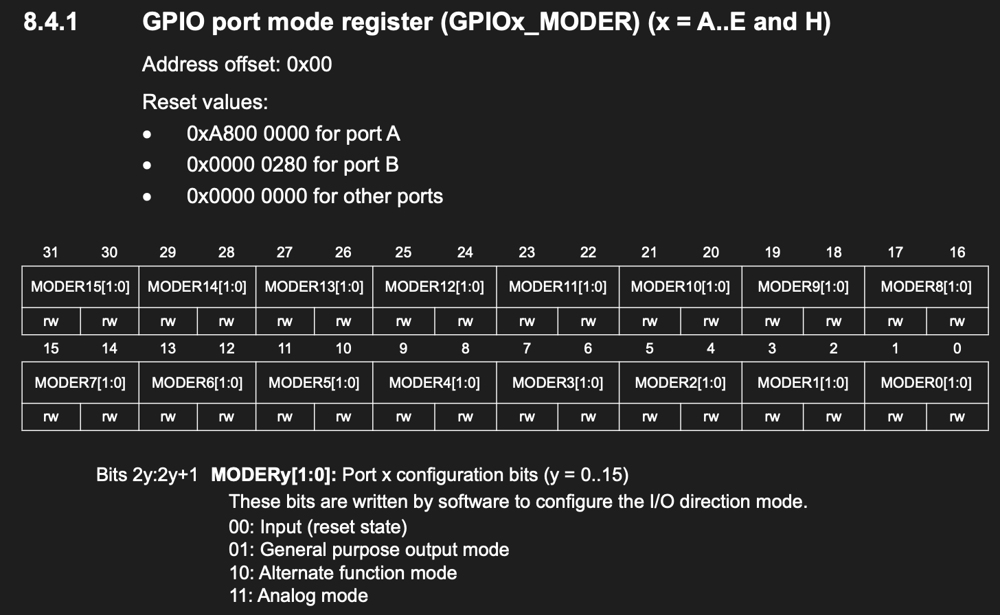

### OTYPER

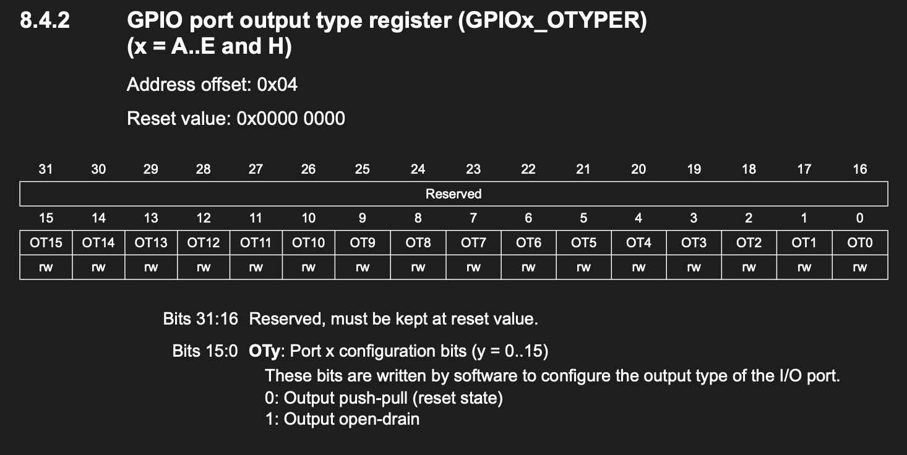

### OSPEEDR

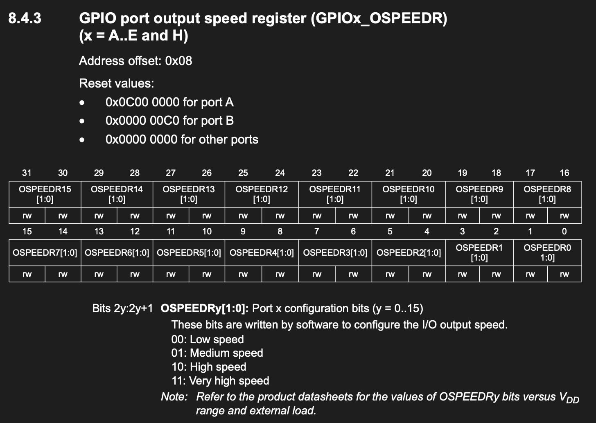

### PUPDR

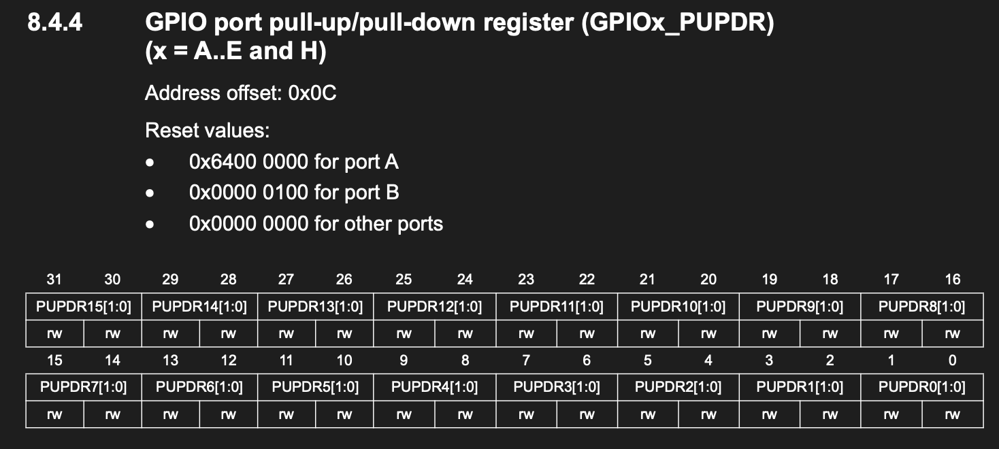


### IDR

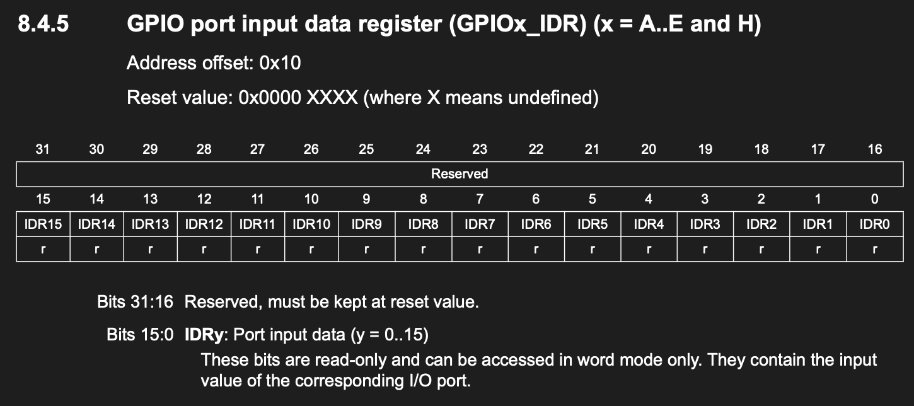

### ODR

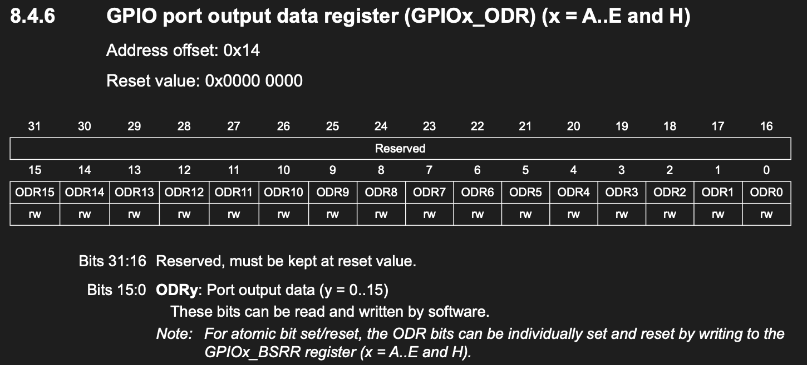

### BSRR

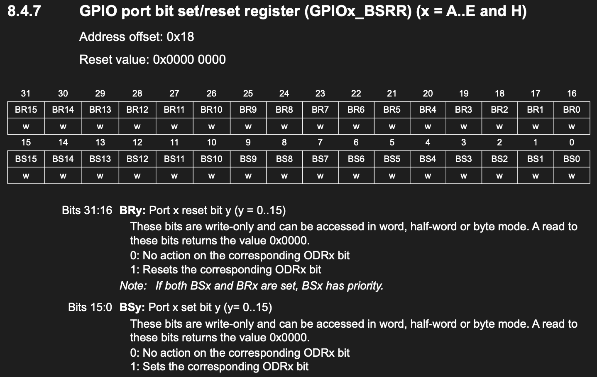

### LCKR

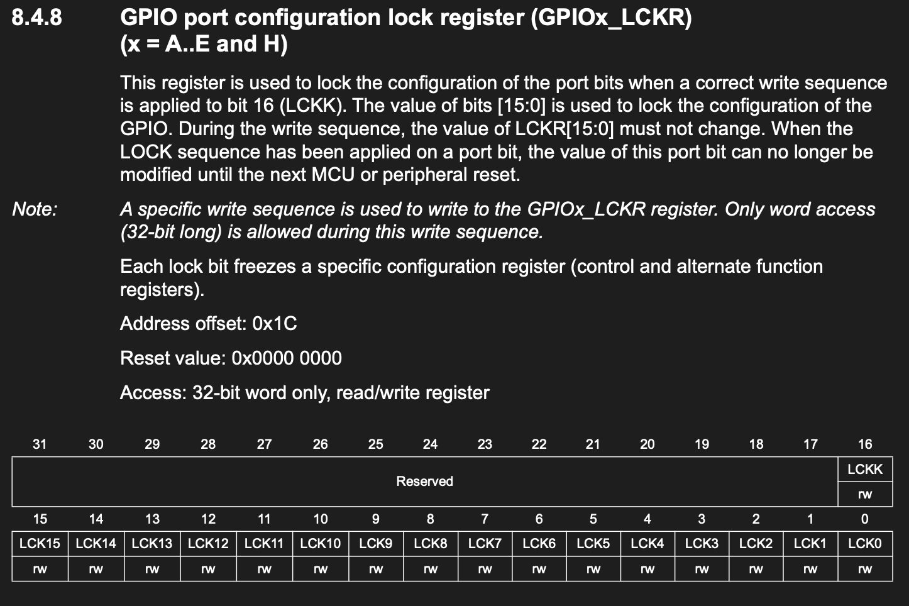
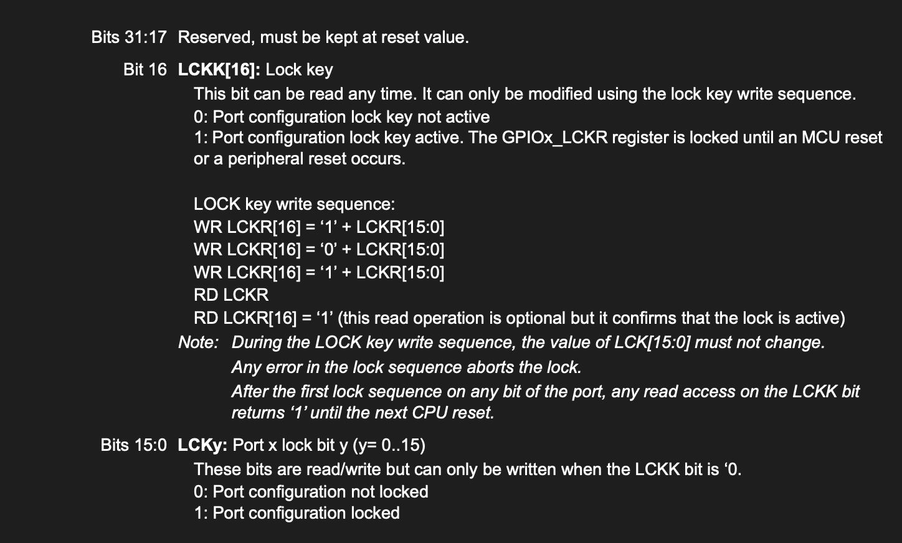

### AFRL

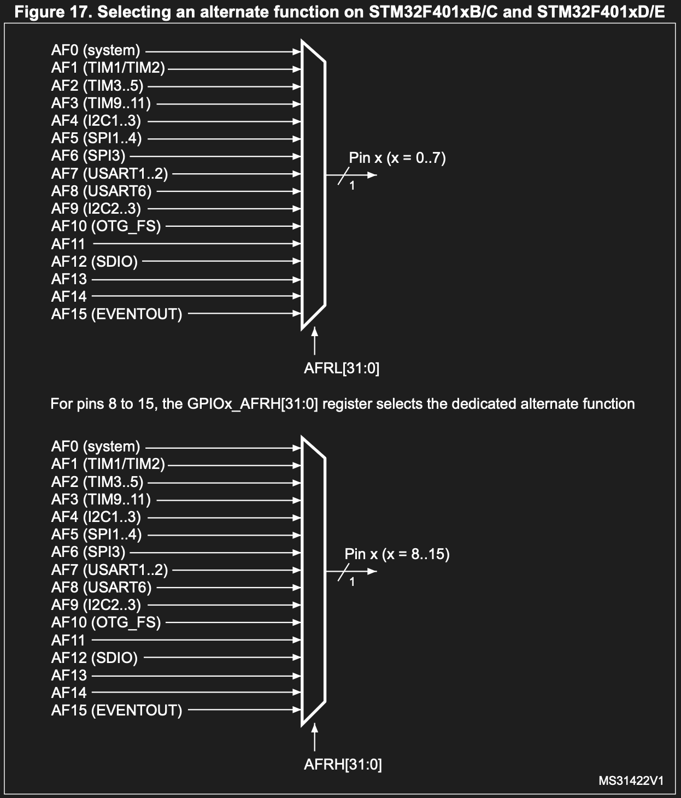
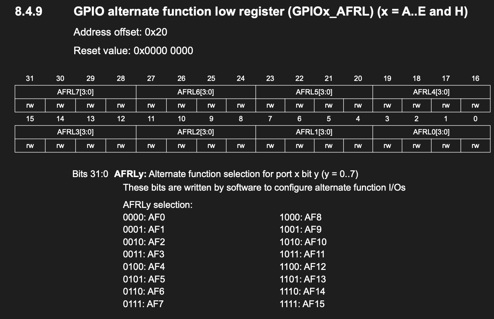

### AFRH

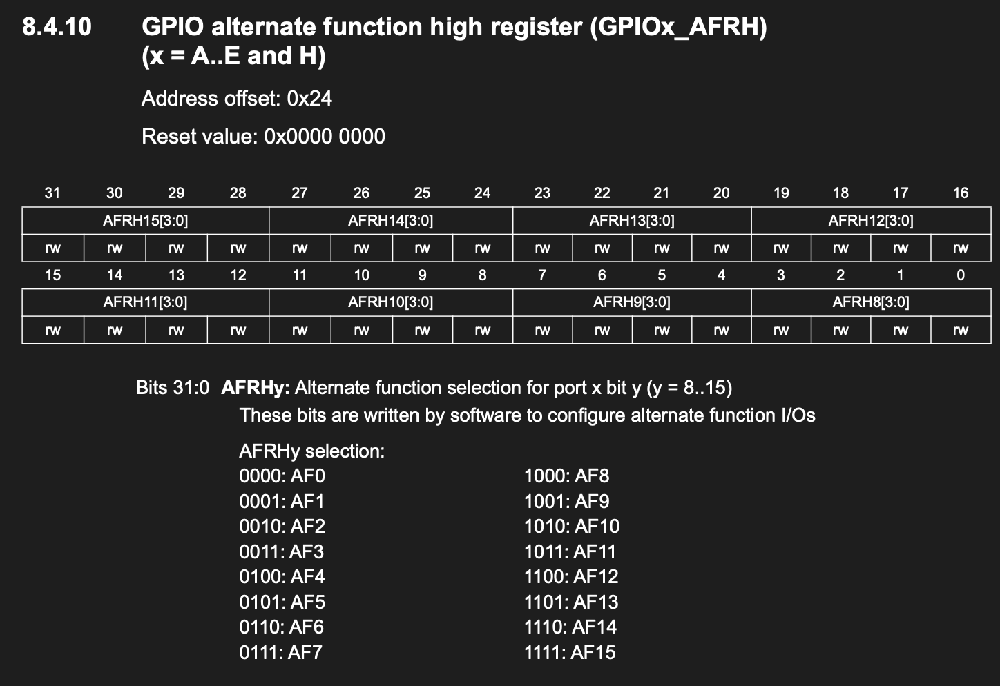


## Basic Register Address Calculation

The register address is:

```text
register address = GPIO port base address + register offset
```

Example: `GPIOC_MODER`

```text
GPIOC_BASE   = 0x40020800
MODER offset = 0x00

GPIOC_MODER  = 0x40020800 + 0x00
             = 0x40020800
```

Example: `GPIOC_BSRR`

```text
GPIOC_BASE   = 0x40020800
BSRR offset  = 0x18

GPIOC_BSRR   = 0x40020800 + 0x18
             = 0x40020818
```

In C, this can be represented with a struct:

```c
typedef struct {
    __IO MODER;   //offset 0x00
    __IO OTYPER;  //offset 0x04
    __IO OSPEEDR; //offset 0x08
    __IO PUPDR;   //and so on, instead of define each offset, a structure can automaticially pile up the gap
    __IO IDR;     //sometimes there are zero in between, thats because there are gaps between registers
    __IO ODR;
    __IO BSRR;
    __IO LCKR;
    __IO AFRL;
    __IO AFRH;
} GPIO_TypeDef;
```

Then:

```c
#define GPIOC ((GPIO_TypeDef *)GPIOC_BASE)
```

So:

```c
GPIOC->MODER
```

accesses:

```text
GPIOC_BASE + 0x00
```

and:

```c
GPIOC->BSRR
```

accesses:

```text
GPIOC_BASE + 0x18
```

## GPIO Clock Enable

Before using a GPIO port, its clock must be enabled in `RCC_AHB1ENR`.

`RCC_AHB1ENR` is at:

```text
RCC_BASE + 0x30
```

GPIO clock enable bits:

| Port | Bit in `RCC_AHB1ENR` |
| ---- | -------------------- |
| GPIOA | bit 0 |
| GPIOB | bit 1 |
| GPIOC | bit 2 |
| GPIOD | bit 3 |
| GPIOE | bit 4 |
| GPIOH | bit 7 |

Example: enable GPIOC clock:

```c
RCC_AHB1ENR |= (1UL << 2);
```

The bit number can be calculated from the GPIO base address:

```c
offset = (GPIOx_BASE - GPIOA_BASE) / 0x400;
```

Example for GPIOC:

```text
GPIOC_BASE - GPIOA_BASE = 0x40020800 - 0x40020000
                         = 0x800

0x800 / 0x400 = 2
```

So GPIOC uses bit 2 in `RCC_AHB1ENR`.

## MODER Bit Manipulation

Each pin uses 2 bits in `MODER`.

| Mode | Binary | Meaning |
| ---- | ------ | ------- |
| `00` | `0` | Input |
| `01` | `1` | Output |
| `10` | `2` | Alternate function |
| `11` | `3` | Analog |

Pin `n` starts at bit:

```text
n * 2
```

For PC13:

```text
13 * 2 = 26
```

So PC13 uses `MODER` bits 27:26.

To clear the mode bits:

```c
GPIOC->MODER &= ~(0x03UL << (13 * 2));
```

To set PC13 as output:

```c
GPIOC->MODER |= (0x01UL << (13 * 2));
```

General form:
```c
port->MODER &= ~(0x03UL << (pin * 2));
port->MODER |=  (mode   << (pin * 2));
```

## BSRR Bit Manipulation

`BSRR` is used to set or reset output pins.

Lower 16 bits set pins:

```text
bit 0  sets pin 0
bit 1  sets pin 1
...
bit 13 sets pin 13
```

Upper 16 bits reset pins:

```text
bit 16 resets pin 0
bit 17 resets pin 1
...
bit 29 resets pin 13
```

Set PC13:

```c++
GPIOC->BSRR = (1UL << 13);
```

Reset PC13:

```c++
GPIOC->BSRR = (1UL << (13 + 16));
```

Prefer writing with `=` instead of `|=` because `BSRR` is a write-only action register.


## Why use BSRR is better than ODR
Examples of using ODR :
```c++
GPIOC->ODR |= (1UL << 13);
```
There are three steps performed, 1. read from ODR, 2. OR modify the data 3. write back, takes three clock cycles. if a interrupt
happend during these steps, the data may lost.

However, when using BSRR:
```c++
GPIOC->BSRR = 13UL;
```
directly write with one clock cycle, which is more secure and efficient


## IDR Bit Manipulation

`IDR` reads the current input state.

Read PA0:

```c
bool state = (GPIOA->IDR >> 0) & 0x01;
```

General form:

```c
bool state = (port->IDR >> pin) & 0x01;
```

## Example: Blink PC13

```c
gpio_init(GPIOC, 13, OUTPUT);

while (1) {
    gpio_set(GPIOC, 13, true);
    delay(500);
    gpio_set(GPIOC, 13, false);
    delay(500);
}
```

For many STM32 boards, the PC13 LED is active-low. That means:

```text
GPIO low  = LED on
GPIO high = LED off
```

So if the LED appears inverted, that is normal for PC13 boards.
