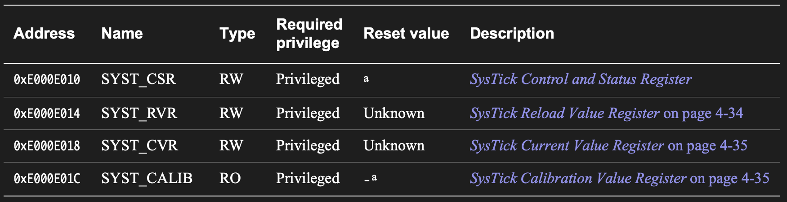
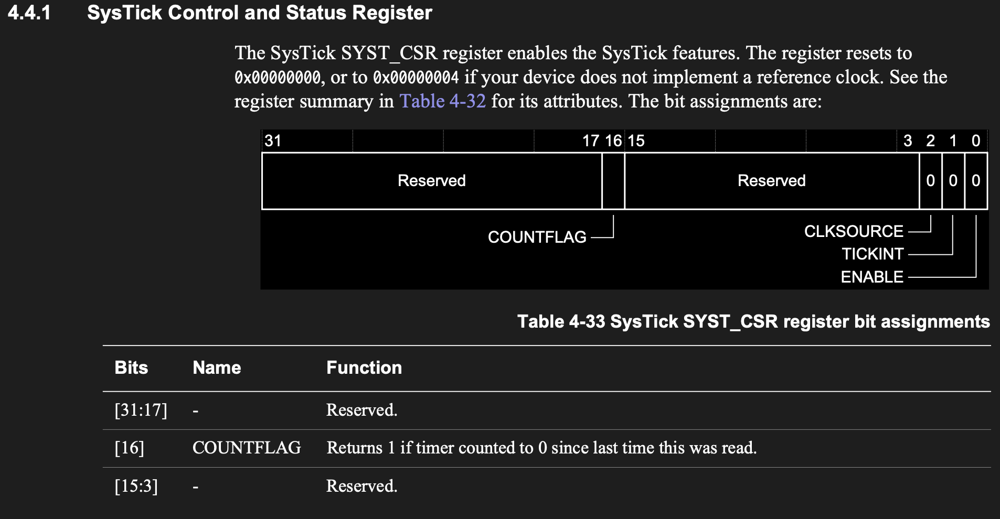
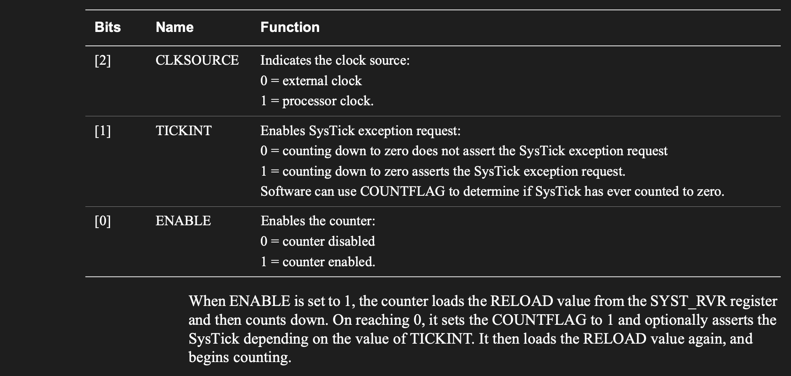
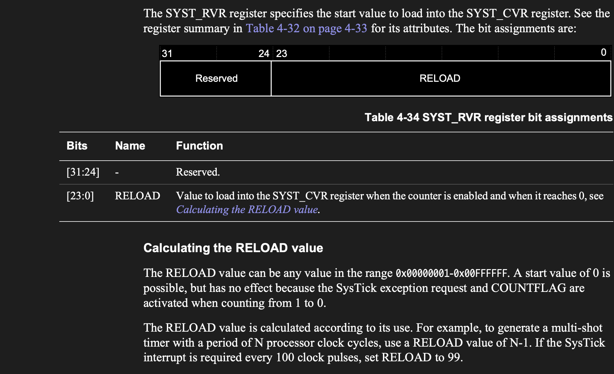
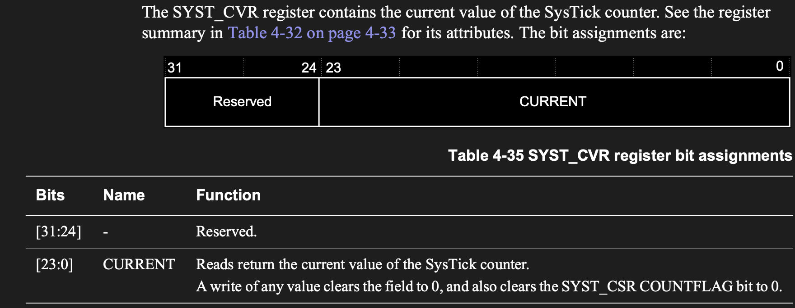
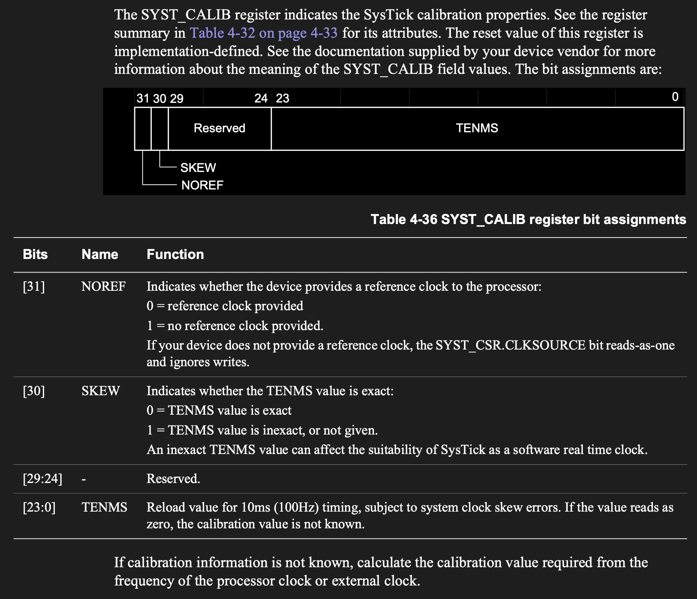

# SysTick

SysTick is a 24-bit countdown timer inside the Cortex-M4 core. It is not an STM32 peripheral on AHB/APB like GPIO or USART. It belongs to the ARM core itself, so it is available on Cortex-M microcontrollers from many vendors.

**Its register layout and reference is not in the standard vendor reference mannual** like ST f4xx RM, instead its a ARM core feature
that is defined and specified in teh Cortex™-M4 Devices Generic User Guide, In my case is `DUI0553.pdf`

SysTick is commonly used for:

- simple blocking delays
- a 1 ms operating-system tick
- periodic interrupts
- measuring short time intervals

In this project, SysTick is used for a making millisecond delay.

## SysTick Register Map

SysTick starts at:

```text
SYS_TICK_BASE = 0xE000E010
```

The register layout is:

| Register | Offset | Function |
| -------- | ------ | -------- |
| [`CSR`](#csr) | `0x00` | Control and status register |
| [`RVR`](#rvr) | `0x04` | Reload value register |
| [`CVR`](#cvr) | `0x08` | Current value register |
| [`CALIB`](#calib) | `0x0C` | Calibration value register |



This can be represented as:

```c++
typedef struct {
    __IO CSR;
    __IO RVR;
    __IO CVR;
    __IO CALIB;
} SysTick_type;
```

## CSR

`CSR` means Control and Status Register.




#### note once the countdown reaches zero, the COUNTFLAG will be set, but the reload is automatic, its not required to set the flag to zero till next run
Important bits:

| Bit | Name | Meaning |
| --- | ---- | ------- |
| 0 | `ENABLE` | Enables SysTick when set to `1` |
| 1 | `TICKINT` | Enables SysTick interrupt when set to `1` |
| 2 | `CLKSOURCE` | Selects clock source |
| 16 | `COUNTFLAG` | Becomes `1` when the counter reaches zero |

For a simple blocking delay without interrupts:

```c++
SYST->CSR |= (1UL << 2);
```

This selects the processor clock as the SysTick clock source.

Then:

```c++
SYST->CSR |= (1UL << 0);
```

enables the counter.

To wait until the counter reaches zero:

```c++
while ((SYST->CSR & (1UL << 16)) == 0) {
}
```

`COUNTFLAG` is cleared when software reads `CSR`.

## RVR

`RVR` means Reload Value Register.



This register controls how far SysTick counts down from.

SysTick counts:

```text
RVR, RVR - 1, RVR - 2, ... 0
```

When it reaches zero:

- `COUNTFLAG` becomes `1`
- the counter reloads from `RVR`
- if interrupt is enabled, a SysTick interrupt happens

Because the counter includes zero, the reload value is usually:

```text
reload = ticks - 1
```

For a 1 ms tick at 16 MHz:

```text
16 MHz = 16,000,000 cycles per second
1 ms   = 1/1000 second

16,000,000 / 1000 = 16,000 cycles
```

So:

```c++
SYST->RVR = 16000 - 1;
```

SysTick is 24-bit, so the maximum reload value is:

```text
0x00FFFFFF
```

## CVR

`CVR` means Current Value Register.



This register contains the current counter value.

Writing any value to `CVR` clears the current counter value and also clears `COUNTFLAG`.

For delay setup, it is common to write:

```c++
SYST->CVR = 0;
```

This forces SysTick to start cleanly from the reload value.

## CALIB

`CALIB` means Calibration Value Register.



This register gives calibration information provided by the processor implementation.

Important fields:

| Field | Meaning |
| ----- | ------- |
| `TENMS` | Reload value for 10 ms timing, if implemented |
| `SKEW` | Calibration value is not exact |
| `NOREF` | Reference clock is not provided |

For simple bare-metal delay code, this project does not use `CALIB`. It directly assumes the CPU clock is 16 MHz and writes `RVR = 16000 - 1`.

## Delay Flow

The delay flow used in this project is:

1. Select processor clock as SysTick source.
2. Set reload value for 1 ms.
3. Clear current value.
4. Enable SysTick.
5. Wait for `COUNTFLAG` once per millisecond.
6. Disable SysTick when finished.

Code pattern:

```c++
SYST->CSR |= (1UL << 2);
SYST->RVR = 16000 - 1; // 16M / 16K = 1000, so 1000 splits for 1s, which is 1ms interval
SYST->CVR = 0;
SYST->CSR |= (1UL << 0);

for (int i = 0; i < time_ms; i++) {
    while ((SYST->CSR & (1UL << 16)) == 0) {
    }
}

SYST->CSR &= ~(1UL << 0);
```

This works if the processor clock is 16 MHz.

## CMSIS Usage

CMSIS normally defines SysTick register access for you. In CMSIS, the SysTick peripheral is usually exposed as:

```c++
SysTick
```

Example register access:

```c++
SysTick->CTRL
SysTick->LOAD
SysTick->VAL
SysTick->CALIB
```

These correspond to this project's names:

| This project | CMSIS name |
| ------------ | ---------- |
| `CSR` | `CTRL` |
| `RVR` | `LOAD` |
| `CVR` | `VAL` |
| `CALIB` | `CALIB` |

CMSIS also provides:

```c++
SysTick_Config(ticks);
```

Example for a 1 ms interrupt tick at 16 MHz:

```c++
SysTick_Config(16000);
```

That configures SysTick and enables its interrupt. Then **You** provide the interrupt handler:

```c++
void SysTick_Handler(void)
{
    // runs every 1 ms
}
```

For this bare-metal project, the code does not use CMSIS `SysTick_Config()`. It writes the SysTick registers directly so the register behavior is visible.

## Common Mistakes

- `RVR` should be `ticks - 1`.
- Forgetting to clear `CVR` before starting.
- Assuming the clock is 16 MHz when PLL or clock setup has changed it.
- Enabling `TICKINT` without defining `SysTick_Handler`.
- Waiting on `COUNTFLAG` before enabling SysTick.
